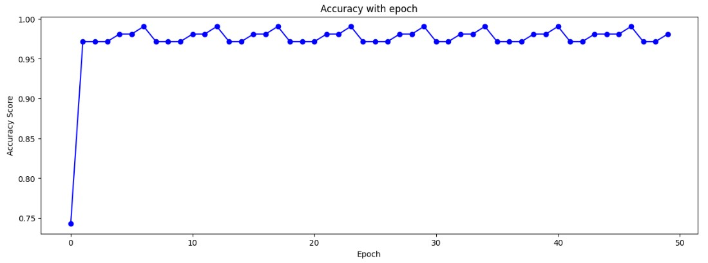

# 🧠 Perceptron from Scratch

## 🧠 Single-Layer Perceptron from Scratch
This section contains a simple implementation of a **single-layer perceptron** using **Python** and **NumPy**, without relying on machine learning libraries like scikit-learn or TensorFlow.

---

### 📌 Features

- Implements the classic Perceptron learning algorithm.
- Trained on the **Iris dataset** using only **petal length** and **petal width** as features.
- Customizable number of epochs and learning rate.
- Tracks performance metrics.
- Includes utilities for plotting learning curves.

---

### 🚀 How It Works

#### 1. **Initialization**
- Weights are initialized as zeros or random values
- Bias is initialized to zero

#### 2. **Forward Pass**
- Compute linear output:  
  'z = wᵀ · x + b'
- Apply activation function (Heaviside)

#### 3. **Training Loop**
- Loop over examples and update weights:
  'w ← w + η × (y - ŷ) × x'
  'b ← b + η × (y - ŷ)'
  where:  
  - `w` = weight vector  
  - `b` = bias term  
  - `η` = learning rate  
  - `y` = true label  
  - `ŷ` = predicted label  
  - `x` = input feature vector 

#### 4. **Evaluation**
- Predict on the Iris dataset
- Compute metrics like precision, recall, F1-score

### ✅ Results
Highlight key findings, metrics, or visuals.

| Class            | Precision  | Recall   | f1-score |
|------------------|------------|----------|----------|
| 0                |    100%    |   96%    |   98%    |
| 1                |    95%     |   100%   |   97%    |

Epoch learning of perceptron:

## 🧠 Multi-Layer Perceptron from Scratch
This section contains a simple implementation of a **multi-layer perceptron** using **Python** and **NumPy**, without relying on machine learning libraries like scikit-learn or TensorFlow.

---

### Features

- Fully connected MLP with one hidden layer
- Forward propagation with sigmoid and ReLU activation functions
- Backpropagation to compute gradients manually
- Training on small datasets with batch size support
- Weight and bias initialization
- Supports binary classification tasks
- Accuracy monitoring during training

---
### **Evaluation**
- Predict on the Iris dataset
- Compute accuracy

---
### ✅ Results
Accuracy = 92.5% on Iris dataset

---

## Motivation

This project helped me dive deep into the core mechanics of neural networks and gradient descent optimization, including:

- How weights and biases are updated using gradients
- Importance of correct gradient sign and update direction
- Challenges like vanishing gradients and weight initialization
- Debugging training issues such as stagnant or diverging errors
- Overfitting a single sample as a sanity check

---