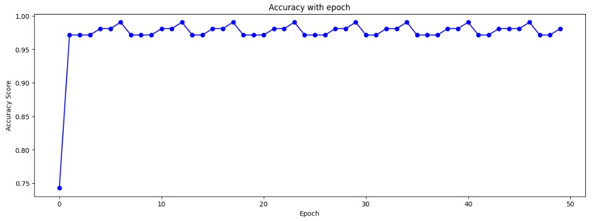

# 🧠 Single-Layer Perceptron from Scratch

This repository contains a simple implementation of a **single-layer perceptron** using **Python** and **NumPy**, without relying on machine learning libraries like scikit-learn or TensorFlow.

---

## 📌 Features

- Implements the classic Perceptron learning algorithm.
- Trained on the **Iris dataset** using only **petal length** and **petal width** as features.
- Customizable number of epochs and learning rate.
- Tracks performance metrics.
- Includes utilities for plotting learning curves.

---

## 🚀 How It Works

### 1. **Initialization**
- Weights are initialized as zeros or random values
- Bias is initialized to zero

### 2. **Forward Pass**
- Compute linear output:  
  \[
  z = \mathbf{w}^\top \mathbf{x} + b
  \]
- Apply activation function (Heaviside)

### 3. **Training Loop**
- Loop over examples and update weights:
  \[
  \mathbf{w} \leftarrow \mathbf{w} + \eta \cdot (y - \hat{y}) \cdot \mathbf{x}
  \]
  \[
  b \leftarrow b + \eta \cdot (y - \hat{y})
  \]

### 4. **Evaluation**
- Predict on the Iris dataset
- Compute metrics like precision, recall, F1-score

## ✅ Results
Highlight key findings, metrics, or visuals.

| Class            | Precision  | Recall   | f1-score |
|------------------|------------|----------|----------|
| 0                |    100%    |   96%    |   98%    |
| 1                |    95%     |   100%   |   97%    |

Epoch learning of perceptron:
